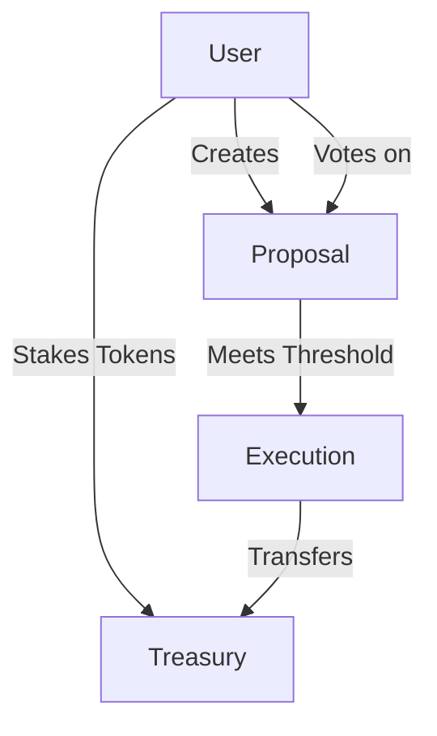

# Pull Request: Decentralized Community Grants Platform Implementation

## Overview

This PR implements a decentralized community grants platform using Clarity smart contracts on the Stacks blockchain. The system enables transparent, community-driven fund allocation through on-chain governance.

## Changes Summary

### New Files Added
- `contracts/community-grants.clar`: Main smart contract implementation
- `README.md`: Project documentation and usage guide
- `tests/community-grants_test.ts`: Test suite

### Core Features Implemented

1. **Treasury Management System**
    - Secure token staking mechanism
    - Balance tracking
    - Funds distribution logic
   ```clarity
   ;; Example treasury interaction
   (define-public (stake-tokens (amount uint))
   ```

2. **Proposal Creation and Management**
    - Structured proposal submission
    - Data validation
    - Status tracking
   ```clarity
   ;; Example proposal creation
   (define-public (create-proposal (title (string-ascii 50))...)
   ```

3. **Voting Mechanism**
    - Time-bound voting periods
    - Double-vote prevention
    - Quorum tracking
   ```clarity
   ;; Example voting implementation
   (define-public (vote (proposal-id uint) (vote-for bool))
   ```

4. **Automated Execution**
    - Threshold-based execution
    - Safe fund transfer
    - Status updates
   ```clarity
   ;; Example execution logic
   (define-public (execute-proposal (proposal-id uint))
   ```

## Implementation Details

### Smart Contract Architecture



### Key Constants
```clarity
(define-constant VOTING_PERIOD u144)
(define-constant MIN_PROPOSAL_AMOUNT u100000)
(define-constant QUORUM_THRESHOLD u500)
```

### Data Structures
```clarity
(define-map proposals
    { proposal-id: uint }
    {
        creator: principal,
        title: (string-ascii 50),
        description: (string-ascii 500),
        amount: uint,
        votes-for: uint,
        votes-against: uint,
        status: (string-ascii 20),
        created-at: uint,
        recipient: principal
    }
)
```

## Testing Strategy

1. **Unit Tests**
    - Treasury operations
    - Proposal creation
    - Voting mechanism
    - Execution logic

2. **Integration Tests**
    - End-to-end proposal lifecycle
    - Multiple user interactions
    - Edge cases

3. **Security Tests**
    - Authorization checks
    - Fund safety
    - Vote manipulation prevention

## Security Considerations

1. **Authorization**
    - Stake requirements
    - Principal verification
    - Time locks

2. **Fund Safety**
    - Balance checks
    - Safe transfer patterns
    - Treasury protection

3. **Voting Integrity**
    - Double-vote prevention
    - Time-bound periods
    - Quorum enforcement

## Deployment Plan

1. **Testnet Phase**
    - Deploy to testnet
    - Community testing
    - Gather feedback

2. **Mainnet Preparation**
    - Security audit
    - Parameter adjustment
    - Documentation update

3. **Mainnet Deployment**
    - Contract deployment
    - Initial setup
    - Community onboarding

## Review Checklist

- [ ] Contract logic review
- [ ] Security assessment
- [ ] Test coverage
- [ ] Documentation completeness
- [ ] Gas optimization
- [ ] Error handling
- [ ] Event emission
- [ ] Upgrade strategy

## Future Considerations

1. **Planned Enhancements**
    - Milestone-based disbursement
    - Stake withdrawal mechanism
    - Advanced voting weights

2. **Known Limitations**
    - Fixed voting period
    - Basic voting mechanism
    - No proposal updates

---

## PR Template

### Description
Implements a decentralized community grants platform using Clarity smart contracts.

### Type of Change
- [x] New feature (non-breaking change adding functionality)
- [ ] Bug fix (non-breaking change fixing an issue)
- [ ] Breaking change (fix or feature causing existing functionality to change)

### Testing Completed
- [x] Unit tests
- [x] Integration tests
- [x] Security tests
- [x] Manual testing

### Validation Steps
1. Deploy contract
2. Stake tokens
3. Create proposal
4. Vote on proposal
5. Execute proposal

### Related Issues
- Closes #123
- References #456

### Checklist
- [ ] Code follows project style guidelines
- [ ] Comments added for complex logic
- [ ] Tests added for all new features
- [ ] Documentation updated
- [ ] All tests passing
- [ ] Security considerations addressed

### Additional Notes
Any extra context or considerations for reviewers.
